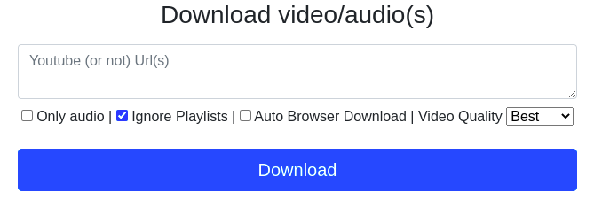

# youtube-dl-webui

Keys: download videos and audio for many platforms + webui + multi urls and playlists + download to your browser + video quality selection + ytb-dl auto-update + Docker native + light + Raspberry PI Compatible

A simple Web UI to download Video/Sound from youtube and others platforms.

## Updated interface

## Alternatives

- The CLI tool (That makes 99% of the job) : https://github.com/yt-dlp/yt-dlp
- WebUIs :
  - https://github.com/d0u9/youtube-dl-webui
  - https://github.com/timendum/Youtube-dl-WebUI
  - https://github.com/manbearwiz/youtube-dl-server
  - https://github.com/Tzahi12345/YoutubeDL-Material
  - https://github.com/Rudloff/alltube
- Some GUIs are also available
